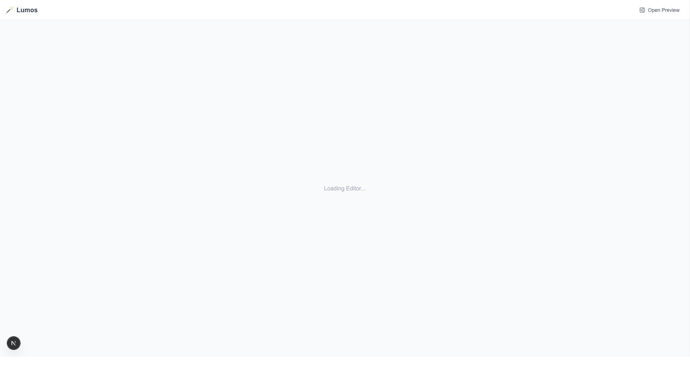

# Lumos 🪄

**Lumos** 是一个Markdown原生的“概念即演示”引擎。它能将单一的 Markdown 文档瞬间转化为精美的 **幻灯片 (Slides)** 和 **思维导图 (Mind Maps)**。

> **一个源文件，无限种视图。**
> 告别排版，专注于创造。



## ✨ 核心特性

- **📝 沉浸式编辑器**: 
  - 基于 **Vditor** 的全屏 Markdown 编辑体验。
  - 支持 **即时渲染 (IR)** 模式，所见即所得。
  - 提供 **源码模式**，满足极客的微调需求。

- **📊 动态思维导图**: 
  - 基于 **Markmap** 的实时可视化。
  - **智能布局**：自动折叠超过 2 层深度的节点，保持界面整洁。
  - **深色/浅色模式**：独立的脑图主题切换，支持暗黑模式 (`Dracula`)。
  - **SVG 导出**：一键下载高保真矢量图，方便二次编辑。

- **📽️ 演示幻灯片**: 
  - 基于 **Reveal.js** 的专业级演示文稿。
  - **10+ 款主题**：内置 Dracula (默认), Black, White, League, Sky 等多种风格。
  - **智能导航**：支持键盘方向键翻页，底部带有进度条。
  - **HTML 导出**：生成独立的便携式 HTML 文件，**无需联网**即可在任何设备上演示。

- **💾 本地优先 (Local First)**: 
  - 所有数据实时保存至浏览器的 **Local Storage**。
  - 无需登录，无云端延迟，隐私安全。

## 🛠️ 技术栈

- **框架**: [Next.js 15](https://nextjs.org/) (App Router)
- **样式**: [Tailwind CSS](https://tailwindcss.com/)
- **编辑器**: [Vditor](https://github.com/Vanessa219/vditor)
- **可视化**: 
  - [Markmap](https://markmap.js.org/) (思维导图)
  - [Reveal.js](https://revealjs.com/) (幻灯片)
- **图标**: [Lucide React](https://lucide.dev/)

## 🚀 快速开始

1. **克隆仓库**
   ```bash
   git clone https://github.com/CrazyMrYan/lumos.git
   cd lumos
   ```

2. **安装依赖**
   ```bash
   npm install
   ```

3. **启动开发服务器**
   ```bash
   npm run dev
   ```

4. **打开浏览器**
   访问 [http://localhost:3000](http://localhost:3000) 即可体验。

## 📦 部署指南

本项目已针对静态导出进行优化 (`output: "export"`)。你可以将其部署到：
- **GitHub Pages** (本项目已配置 GitHub Actions 自动部署)
- Vercel
- Netlify
- 任何支持静态网站的托管服务

## 📄 许可证

私有项目 (Private Project). All rights reserved.
